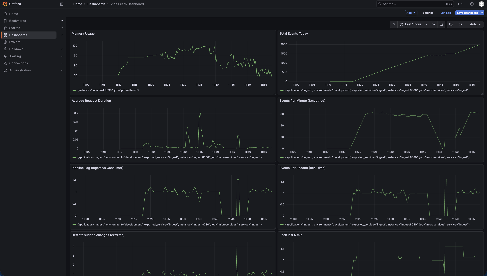

# Vibe-Learn

Vibe-Learn is a **VS Code extension + Dockerized backend** that records “code line events” during a dev session and streams them into a small microservice pipeline. The backend stores events in MongoDB, exposes analytics, and is fully monitored with **Prometheus + Grafana**.

## What’s in this repo

- **VS Code extension** (`extension.js`): records code edits and sends events to the ingest API.
- **Ingest service** (`spring-boot-ingest`): REST API that accepts events and produces them to Kafka.
- **Consumer service** (`spring-boot-consumer`): consumes events from Kafka and persists them to MongoDB.
- **Analytics service** (`spring-boot-analytics`): consumes events and exposes aggregated/session analytics (also exposes Prometheus metrics).
- **Infra (Docker Compose)**: Kafka (KRaft), MongoDB, Kafka UI, Mongo Express, Prometheus, Grafana.

## Quickstart (Docker)

### Prerequisites

- **Docker Desktop** (includes `docker compose`)

### Start everything

From the `vibe-learn/` directory:

```bash
docker compose up --build
```

### Useful local URLs

- **Ingest API**: `http://localhost:8080`
- **Consumer**: `http://localhost:8081`
- **Analytics**: `http://localhost:8083`
- **Kafka UI**: `http://localhost:8088`
- **Mongo Express**: `http://localhost:8089`
- **Prometheus**: `http://localhost:9090`
- **Grafana**: `http://localhost:3000` (default login **admin/admin**)

## Using the VS Code extension (recording)

1. Start the backend stack with Docker Compose.
2. In VS Code, run the extension (Launch Extension / press `F5`).
3. Run **“Vibe-Learn: Start Recording”**, enter a `sessionId`, and start coding.
4. Run **“Vibe-Learn: Stop Recording”** to end the session.

## Vision (where this is going)

The long-term goal of Vibe-Learn is to turn **the lines of code you write** (captured as recorded code-line events) into **personalized learning materials** that help you actually retain what you just built.

Planned outputs include:

- **Session summaries**: “what you changed” + “why it matters” in plain language
- **Quizzes / flashcards**: questions generated from your real code (APIs, patterns, bugs you hit, concepts used)
- **Code-linked explanations**: answers that reference the exact files/lines you worked on
- **Spaced repetition**: resurfacing weak areas over time based on your quiz performance

This repo already has the foundation for that workflow (event capture → Kafka → MongoDB → analytics). The next step is building the learning-material generation layer on top of the recorded sessions.

### API configuration

Right now the extension has the ingest endpoint and API key hard-coded here:

- `API_URL = http://localhost:8080/api/events`
- `API_KEY = custom-api-key-here`

If you change the ingest API key in `docker-compose.yml`, update `extension.js` to match.

## Monitoring (Grafana + Prometheus)

Prometheus is configured to scrape **Spring Boot Actuator** metrics from all microservices at:

- `GET /actuator/prometheus`

Grafana is provisioned with a Prometheus datasource (`grafana/provisioning/datasources/prometheus.yml`).

### Grafana dashboard



### Verify metrics end-to-end

- Open Prometheus → **Status → Targets** and confirm `ingest`, `consumer`, and `analytics` are **UP**
- Open Grafana → Explore → query something like `process_resident_memory_bytes` or `http_server_requests_seconds_count`

## Troubleshooting

- **Grafana shows “No data”**: check Prometheus targets are UP and that each service exposes `/actuator/prometheus`.
- **Extension can’t send events**: confirm `ingest` is running and `extension.js` `API_URL` + `API_KEY` match `docker-compose.yml`.
- **Kafka not healthy**: `docker compose ps` and check `vibe_kafka` healthcheck; it can take ~1–2 minutes on first start.
